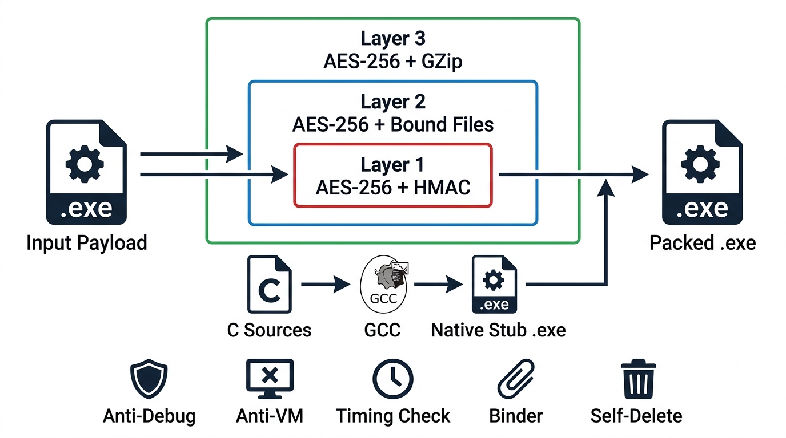
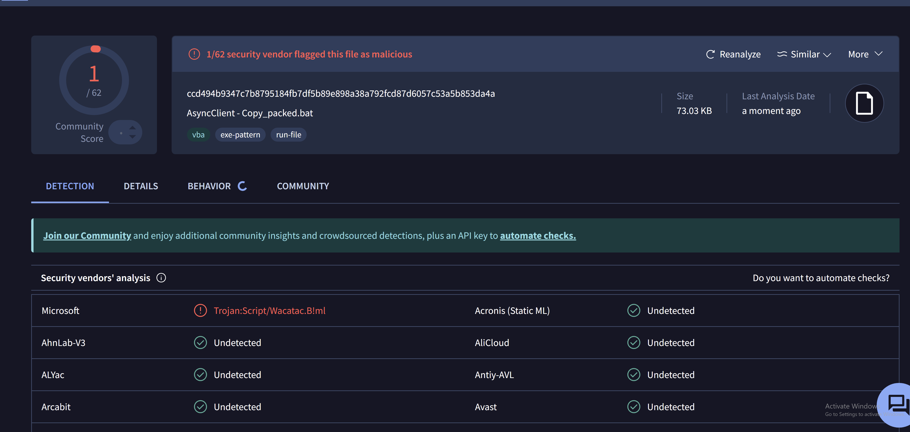

  

# JeisALIVE

.NET crypter & obfuscator and file binder
Inspired by the original Jlaive project

---

## How It Works

Your payload gets encrypted through 3 nested AES layers. A native C stub is generated and compiled on the fly to unpack it at runtime. The stub hosts the .NET CLR to load a managed DLL that handles the final decryption and launches the original payload. Bound files get extracted and opened/executed alongside it.

---

## Scan Results
[x] tested on AsyncRat payload 15-4-2026

---

## Features

- [x] 3-layer AES-256-CBC encryption with HMAC-SHA256 per layer
- [x] Native C loader compiled fresh each build via bundled GCC
- [x] Multi-file binder (bind decoys, documents, other executables)
- [x] Anti-debug, anti-VM, sandbox timing checks
- [x] Self-delete (melt) after execution
- [x] Output as native EXE or obfuscated batch file

### to do list
- [ ] Startup persistence options (registry, scheduled task, startup folder)
- [ ] Delay execution (sleep before payload launch)
- [ ] Shellcode output mode maybe..
---

---

## Credits

Inspired by the original Jlaive project. Rewritten by **gothyo**.

---

## Support

**BTC:** `bc1qv7z5grl02lyac0snwsqd0n5q3pjd0rxp7xwyxd`

**SOL:** `F3d2kDWAGvxXeH68Kx1D2ycQzxsHnjxfVVSFJmkKf4Ng`

**XMR:** `49WKmHs8r6vL3Wd1HD1FGfHWP9gGJobKmZWQ2U91upwTBj1AMo8SZrUWt8bTwCYzUzhhSo5zPYut2AdrRLbCofHX6ZEcP4z`

---
> **LEGAL DISCLAIMER — PLEASE READ!**
>
> I, the creator and all those associated with the development and production of this program are not responsible for any actions and or damages caused by this software. You bear the full responsibility of your actions and acknowledge that this software was created for educational purposes only. This software's intended purpose is NOT to be used maliciously, or on any system that you do not have own or have explicit permission to operate and use this program on. By using this software, you automatically agree to the above.

## License

MIT — see [LICENSE](LICENSE)
